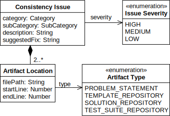

# PECV-bench

[](https://doi.org/10.5281/zenodo.17260262)
[](pecv-reference/pyproject.toml)
[](pecv-reference/pyproject.toml)
[](LICENSE)
[](DATA_LICENSE)

The Programming Exercise Consistency Verification (PECV) benchmark delivers automated consistency verification across multi-artifact programming exercises so course staff can deliver trustworthy assignments faster and with less manual effort.

Grounded in a 91-variant benchmark with 93 gold inconsistencies, the toolkit pairs an ontology-driven dataset with an LLM-based reference pipeline for reproducible evaluation.

## At-a-Glance

| Benchmark | Config Key | N runs | TP | FP | FN | Precision | Recall | F1 | Span F1 | IoU | Avg Time (s) | Avg Cost ($) |
| --- | --- | --- | --- | --- | --- | --- | --- | --- | --- | --- | --- | --- |
| pecv-reference | model=openai:o4-mini, reasoning_effort=medium | 3 | 254 | 148 | 25 | 0.632 | 0.910 | 0.746 | 0.676 | 0.565 | 32.958 | 0.0338 |
| pecv-reference | model=openrouter:google/gemini-2.5-flash, reasoning_effort=medium | 3 | 263 | 623 | 15 | 0.297 | 0.946 | 0.452 | 0.597 | 0.474 | 26.380 | 0.0244 |
| pecv-reference | model=openrouter:google/gemini-2.5-flash-lite-preview-06-17, reasoning_effort=medium | 3 | 216 | 288 | 21 | 0.429 | 0.911 | 0.583 | 0.594 | 0.485 | 16.975 | 0.0063 |
| pecv-reference | model=openrouter:x-ai/grok-3-mini, reasoning_effort=medium | 3 | 233 | 222 | 46 | 0.512 | 0.835 | 0.635 | 0.640 | 0.534 | 14.306 | 0.0061 |

- **N runs**: Number of benchmark executions aggregated to compute the averages above.
- **TP / FP / FN**: True positives, false positives, and false negatives describing how many inconsistencies were correctly found, mistakenly flagged, or missed.
- **Precision**: Share of flagged inconsistencies that are correct, helping gauge how often the detector avoids false alarms.
- **Recall**: Share of gold inconsistencies the detector recovers, reflecting its ability to avoid misses.
- **F1**: Harmonic mean of precision and recall, balancing the trade-off between catching issues and avoiding false alerts.
- **Span F1**: Harmonic mean of span-level precision and recall, rewarding predictions that capture both the correct label and exact boundaries of inconsistent spans.
- **IoU**: Intersection over Union between predicted and gold spans, measuring overlap quality (also known as the Jaccard index).
- **Avg Time (s)**: Mean wall-clock seconds per benchmark run, indicating latency.
- **Avg Cost ($)**: Mean API cost per run, useful for budgeting experiments.

## Why PECV?

- Catch misalignments across problem statements, templates, solutions, and tests before students see them.
- Benchmark new detection approaches on 91 Java variants with 93 labeled inconsistencies spanning six ontology categories.
- Reproduce and extend validated LLM baselines using the packaged CLI, configs, and reporting pipeline.

## Quickstart

### Set up the environment

#### Clone the repository

```bash
git clone https://github.com/ls1intum/pecv-bench.git
cd pecv-bench
```

#### Create a virtual environment

```bash
python3 -m venv .venv
source .venv/bin/activate
```

#### Install dependencies (pip)

Install the workspace directly in editable mode (append `.[dev]` to include linting and formatting tools):

```bash
pip install --upgrade pip
pip install -e .
```

For development workflows that need linters and formatters:

```bash
pip install -e .[dev]
```

Whenever you start a new shell session, reactivate the virtual environment with `source .venv/bin/activate` before running any CLI commands.

#### Configure providers & tracing

The reference runner loads credentials from environment variables (or a `.env` file via [`pydantic-settings`](https://docs.pydantic.dev/latest/usage/pydantic_settings/)). Copy the template and fill in the keys for the providers you plan to use:

```bash
cp pecv-reference/.env.example pecv-reference/.env
```

Update `pecv-reference/.env` (or export the variables in your shell) with the following values:

- **OpenAI (for `openai:*` models)**
  - `OPENAI_API_KEY` – required
  - `OPENAI_BASE_URL` – optional override if you proxy requests (defaults to the official API)

- **Azure OpenAI (for `azure_openai:*` models)**
  - `AZURE_OPENAI_API_KEY` – required
  - `AZURE_OPENAI_ENDPOINT` – required (format: `https://<resource-name>.openai.azure.com`)
  - `AZURE_OPENAI_API_VERSION` – optional, defaults to the latest supported version

- **OpenRouter (for `openrouter:*` models)**
  - `OPENROUTER_API_KEY` – required
  - `OPENROUTER_BASE_URL` – optional if you self-host or use a regional endpoint

- **Other providers**
  - Add keys for any other providers you plan to use (e.g., `ANTHROPIC_API_KEY`, `AI21_API_KEY`, etc.) as described in the [LangChain `init_chat_model` documentation](https://python.langchain.com/api_reference/langchain/chat_models/langchain.chat_models.base.init_chat_model.html).

- **LangSmith tracing & cost aggregation**
  - `LANGSMITH_API_KEY` – required for authenticated tracing
  - `LANGSMITH_TRACING=true` – leave enabled to collect traces
  - `LANGCHAIN_TRACING_V2=true` – ensures LangChain routes telemetry to LangSmith
  - `LANGCHAIN_PROJECT=pecv-bench` (or any project name you prefer)
  - Optional: `LANGCHAIN_ENDPOINT=https://api.smith.langchain.com` if you use a self-hosted deployment

### Run a benchmark

Execute the reference pipeline with OpenAI's `o4-mini` model at medium reasoning effort across all exercises and variants:

```bash
pecv-bench run-benchmark \
  pecv-reference \
  --model openai:o4-mini \
  --reasoning-effort medium \
  --max-concurrency 5
```

### Generate reports

Aggregate any completed runs into Markdown/JSON summaries:

```bash
pecv-bench report --benchmark pecv-reference
```

### CLI overview

The entry point `pecv-bench` exposes all automation helpers. Use the built-in help to explore each command:

```bash
pecv-bench --help
pecv-bench run-benchmark --help
pecv-bench report --help
pecv-bench variants --help
pecv-bench variants-analysis --help
```

### Expected outputs

```text
results/
└── pecv-reference/
    ├── <timestamped-run-id>/
    │   ├── cases/
    │   └── run_report.json
    ├── summary.json
    ├── summary.md
    └── summary.tex
```

Run metadata lives in `runs/pecv-reference/<timestamped-run-id>.yaml`, enabling resumable and auditable experiments.

## Methodology

- **Tasks & datasets:** Three Java programming exercises (Lectures, Panic at Seal Saloon, Space Seal Farm) with 91 perturbed variants and provenance for every injected inconsistency. These programming exercises originate from the [Artemis](https://github.com/ls1intum/Artemis) learning management system, an open-source LMS used to deliver interactive programming education. See the [Artemis README](https://github.com/ls1intum/Artemis/blob/develop/README.md) for platform details and pedagogical context.
- **Inconsistency taxonomy:** Six ontology categories—ATTRIBUTE_TYPE_MISMATCH, METHOD_RETURN_TYPE_MISMATCH, IDENTIFIER_NAMING_INCONSISTENCY, METHOD_PARAMETER_MISMATCH, VISIBILITY_MISMATCH, CONSTRUCTOR_PARAMETER_MISMATCH.
- **Evaluation pipeline:** `run-benchmark` orchestrates prompt construction, model execution, and output parsing; `report` aligns predictions with gold spans and aggregates metrics (precision, recall, F1, span F1, IoU, latency, and cost).


## Consistency Issue Schema



## Reproducibility

- **Configurations:** `configs/pecv-reference.yaml` captures model presets, reasoning effort, and run identifiers. Commit edited configs alongside experiments for traceability.
- **Determinism:** Reasoning models introduce variability in outputs due to inherent randomness.
- **Captured artifacts:** Each run stores raw case outputs under `results/<benchmark>/<run-id>/cases/` plus structured summaries (`run_report.json`). Metadata in `runs/<benchmark>/<run-id>.yaml` records CLI arguments, timestamps, and configuration digests.

## Results

- The At-a-Glance table above surfaces cross-run metrics for the packaged reference configs.
- Detailed aggregates: `results/pecv-reference/summary.md`, machine-readable `summary.json`, and LaTeX-ready `summary.tex`.
- Per-run diagnostics: inspect `results/pecv-reference/<run-id>/run_report.json` alongside per-case artifacts in `results/pecv-reference/<run-id>/cases/`.

### Add your own results

1. Create a config (or reuse `configs/pecv-reference.yaml`) and run `pecv-bench run-benchmark ...` with your approach.
2. Place generated outputs under `results/<benchmark>/<your-run-id>/` and metadata in `runs/<benchmark>/<your-run-id>.yaml`.
3. Re-run `pecv-bench report --benchmark <benchmark>` to update summaries and leaderboard tables.

## License

- **Software:** [MIT License](LICENSE) covers the CLI, reference pipeline, and supporting tooling.
- **Benchmark data, annotations, schemas, and packaged results:** [Creative Commons Attribution 4.0 International](DATA_LICENSE).

Questions, bug reports, or contributions are always welcome—open an issue or pull request to get involved.


# Testing Guide: Variants Analysis and Plotting

The analysis workflow consists of two main steps:

1. **Variants Analysis** (`cli/reporting/metrics.py`): Processes benchmark results and generates a JSON report
2. **Plotting** (`cli/reporting/variants_report_plotter.py`): Generates visualizations from the JSON report

```bash
# Run analysis with default results directory (results/pecv-reference)
pecv-bench variants-analysis

# Generate plots with default output location
pecv-bench variants-analysis --plot
```
