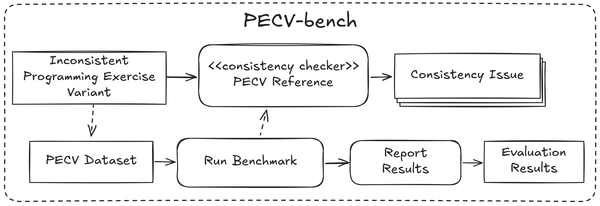
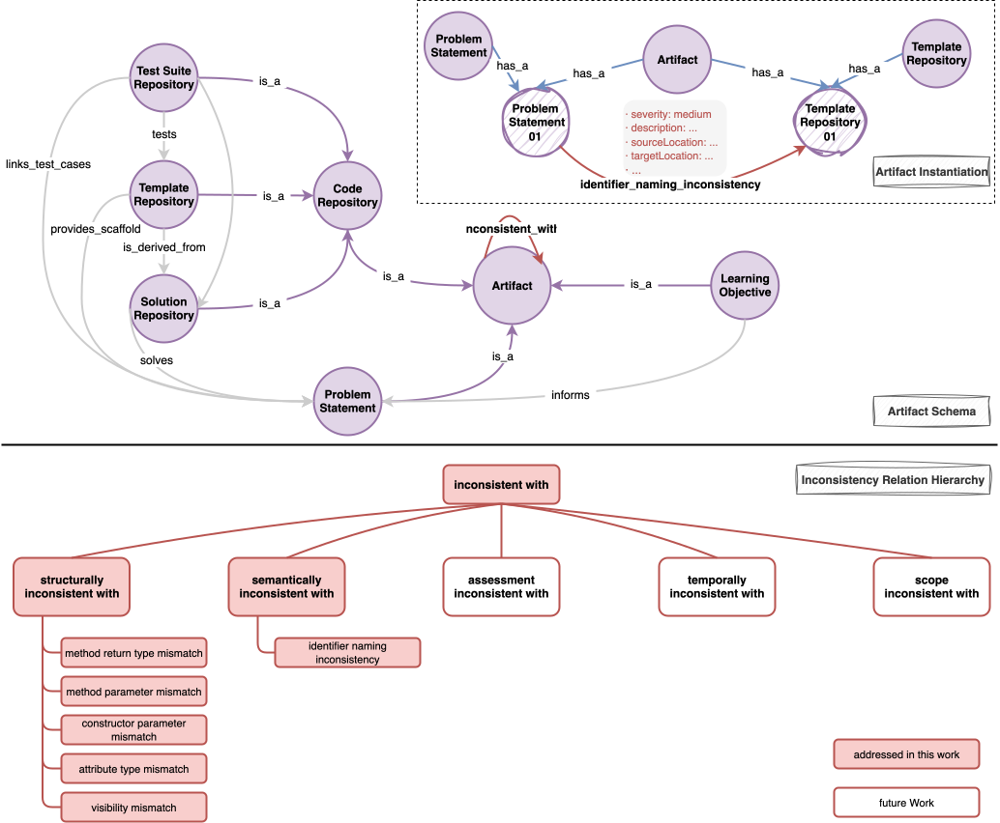
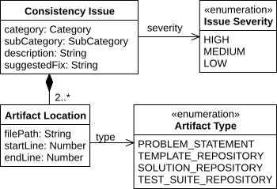

# PECV-bench

[](https://doi.org/10.5281/zenodo.17260263)
[](pecv-reference/pyproject.toml)
[](pecv-reference/pyproject.toml)
[](LICENSE)
[](DATA_LICENSE)

This repository hosts the reproducibility package for the Programming Exercise Consistency Verification (PECV) benchmark. It contains a versioned dataset, CLI configs, and reference LLM pipeline used to evaluate cross-artifact inconsistency detectors in the accompanying paper.

The dataset is split into two versions:

- **V1** — 91 variants across three Java exercises (Lectures, Panic at Seal Saloon, Space Seal Farm), annotating 93 inconsistencies across six ontology categories. This is the version used for the published benchmark results.
- **V2** — Extended dataset covering 13 exercises across multiple programming languages (Java, Python, Assembly, SQL, Swift, and others), adding more variety in exercise type and language.

The reference pipeline—implemented in `pecv-reference/` and requiring external LLM API credentials—reproduces the published results and writes traceable reports under `results/`.

Workflow overview for the packaged benchmark:



## At-a-Glance

Results below are for **V1** (`results/V1/pecv-reference/`).

| Benchmark | Config Key | N runs | TP | FP | FN | Precision | Recall | F1 | Span F1 | IoU | Avg Time (s) | Avg Cost ($) |
| --- | --- | --- | --- | --- | --- | --- | --- | --- | --- | --- | --- | --- |
| pecv-reference | model=openai:o4-mini, reasoning_effort=medium | 3 | 254 | 148 | 25 | 0.632 | 0.910 | 0.746 | 0.676 | 0.565 | 32.958 | 0.0338 |
| pecv-reference | model=openrouter:google/gemini-2.5-flash, reasoning_effort=medium | 3 | 263 | 623 | 15 | 0.297 | 0.946 | 0.452 | 0.597 | 0.474 | 26.380 | 0.0244 |
| pecv-reference | model=openrouter:google/gemini-2.5-flash-lite-preview-06-17, reasoning_effort=medium | 3 | 216 | 288 | 21 | 0.429 | 0.911 | 0.583 | 0.594 | 0.485 | 16.975 | 0.0063 |
| pecv-reference | model=openrouter:x-ai/grok-3-mini, reasoning_effort=medium | 3 | 233 | 222 | 46 | 0.512 | 0.835 | 0.635 | 0.640 | 0.534 | 14.306 | 0.0061 |

- **N runs**: Number of benchmark executions aggregated to compute the averages above.
- **TP / FP / FN**: True positives, false positives, and false negatives describing how many inconsistencies were correctly found, mistakenly flagged, or missed.
- **Precision**: Share of flagged inconsistencies that are correct, helping gauge how often the detector avoids false alarms.
- **Recall**: Share of gold inconsistencies the detector recovers, reflecting its ability to avoid misses.
- **F1**: Harmonic mean of precision and recall, balancing the trade-off between catching issues and avoiding false alerts.
- **Span F1**: Harmonic mean of span-level precision and recall, rewarding predictions that capture both the correct label and exact boundaries of inconsistent spans.
- **IoU**: Intersection over Union between predicted and gold spans, measuring overlap quality (also known as the Jaccard index).
- **Avg Time (s)**: Mean wall-clock seconds per benchmark run, indicating latency.
- **Avg Cost ($)**: Mean API cost per run, useful for budgeting experiments.

## Why PECV?

- Catch misalignments across problem statements, templates, solutions, and tests before students see them.
- Benchmark new detection approaches on annotated variants with labeled inconsistencies spanning six ontology categories.
- Reproduce and extend validated LLM baselines using the packaged CLI, configs, and reporting pipeline.

## Dataset Structure

Data lives under `data/`, split by version:

```text
data/
├── V1/                          # Original benchmark (3 Java exercises, 91 variants)
│   └── ITP2425/
│       ├── H01E01-Lectures/
│       ├── H02E02-Panic_at_Seal_Saloon/
│       └── H05E01-Space_Seal_Farm/
└── V2/                          # Extended dataset (13 exercises, multiple languages)
    ├── ERA2021/                 # Assembly
    ├── IOS26/                   # Swift
    ├── ISE22/                   # mixed
    ├── ITP2425/                 # Java
    ├── MTG26/                   # SQL
    └── QCSL25/                  # Python
```

Each exercise directory contains:

```text
COURSE/EXERCISE/
├── problem-statement.md
├── exercise-details.json
├── solution/
├── template/
├── tests/
└── variants/
    └── 001/
        ├── 001.CATEGORY.md      # human-readable description
        ├── 001.json             # gold annotation
        ├── 001.patch            # git-style patch encoding the injected inconsistency
        └── [materialized files when active]
```

## Quickstart

### Set up the environment

#### Clone the repository

```bash
git clone https://github.com/ls1intum/pecv-bench.git
cd pecv-bench
```

#### Create a virtual environment

```bash
python3 -m venv .venv
source .venv/bin/activate
```

#### Install dependencies

Install the workspace directly in editable mode:

```bash
pip install --upgrade pip
pip install -e .
```

For development workflows that need linters and formatters:

```bash
pip install -e .[dev]
```

Whenever you start a new shell session, reactivate the virtual environment with `source .venv/bin/activate` before running any CLI commands.

#### Configure providers & tracing

The reference runner loads credentials from environment variables (or a `.env` file via [`pydantic-settings`](https://docs.pydantic.dev/latest/usage/pydantic_settings/)). Copy the template and fill in the keys for the providers you plan to use:

```bash
cp pecv-reference/.env.example pecv-reference/.env
```

Update `pecv-reference/.env` (or export the variables in your shell) with the following values:

- **OpenAI (for `openai:*` models)**
  - `OPENAI_API_KEY` – required
  - `OPENAI_BASE_URL` – optional override if you proxy requests (defaults to the official API)

- **Azure OpenAI (for `azure_openai:*` models)**
  - `AZURE_OPENAI_API_KEY` – required
  - `AZURE_OPENAI_ENDPOINT` – required (format: `https://<resource-name>.openai.azure.com`)
  - `AZURE_OPENAI_API_VERSION` – optional, defaults to the latest supported version

- **OpenRouter (for `openrouter:*` models)**
  - `OPENROUTER_API_KEY` – required
  - `OPENROUTER_BASE_URL` – optional if you self-host or use a regional endpoint

- **Other providers**
  - Add keys for any other providers you plan to use (e.g., `ANTHROPIC_API_KEY`, `AI21_API_KEY`, etc.) as described in the [LangChain `init_chat_model` documentation](https://python.langchain.com/api_reference/langchain/chat_models/langchain.chat_models.base.init_chat_model.html).

- **LangSmith tracing & cost aggregation**
  - `LANGSMITH_API_KEY` – required for authenticated tracing
  - `LANGSMITH_TRACING=true` – leave enabled to collect traces
  - `LANGCHAIN_TRACING_V2=true` – ensures LangChain routes telemetry to LangSmith
  - `LANGCHAIN_PROJECT=pecv-bench` (or any project name you prefer)
  - Optional: `LANGCHAIN_ENDPOINT=https://api.smith.langchain.com` if you use a self-hosted deployment

### Run a benchmark

Exercise paths always include the version prefix (`V1` or `V2`).

Run the reference pipeline on all V1 exercises with OpenAI `o4-mini` at medium reasoning effort:

```bash
pecv-bench run-benchmark \
  pecv-reference \
  --model openai:o4-mini \
  --reasoning-effort medium \
  --max-concurrency 5
```

Run on a specific exercise from V1:

```bash
pecv-bench run-benchmark \
  --exercise V1/ITP2425/H01E01-Lectures \
  --model openai:o4-mini \
  --reasoning-effort medium
```

Run on a specific exercise from V2:

```bash
pecv-bench run-benchmark \
  --exercise V2/QCSL25/QC03-Magic_State_Distillation \
  --model openai:o4-mini \
  --reasoning-effort medium
```

Results are written to `results/V1/pecv-reference/` or `results/V2/pecv-reference/` depending on the exercise version.

### Generate reports

Aggregate completed runs into Markdown/JSON/LaTeX summaries. Pass `--results-dir` as the full path to the benchmark directory. The version is inferred from the path automatically.

```bash
# V1 (default — equivalent to omitting --results-dir)
pecv-bench report

# V2
pecv-bench report --results-dir results/V2/pecv-reference

# Custom benchmark name
pecv-bench report --results-dir results/V1/my-experiment
```

### Analyze variant consistency

The `variants-analysis` command groups results by model and generates scatter plots (tokens vs. F1).

```bash
# V1 (default)
pecv-bench variants-analysis

# V2
pecv-bench variants-analysis --results-dir results/V2/pecv-reference

# Clear previous analysis artifacts, then re-run and plot
pecv-bench variants-analysis --results-dir results/V2/pecv-reference --clear
pecv-bench variants-analysis --results-dir results/V2/pecv-reference --plot
```

### CLI overview

The entry point `pecv-bench` exposes all automation helpers. Use the built-in help to explore each command:

```bash
pecv-bench --help
pecv-bench variants --help
pecv-bench run-benchmark --help
pecv-bench report --help
pecv-bench variants-analysis --help
```

#### `pecv-bench variants`

Manage dataset variants (list, init, materialize, clean, annotate).

All subcommands accept `-e VERSION/COURSE/EXERCISE`. Omitting `-e` operates across all versions and exercises.

```bash
# List all variants across all versions
pecv-bench variants list

# List all V2 variants
pecv-bench variants list -e V2

# List variants for one exercise
pecv-bench variants list -e V1/ITP2425/H01E01-Lectures

# Materialize a variant (applies its patch)
pecv-bench variants materialize -e V2/QCSL25/QC03-Magic_State_Distillation -v 007

# Clean materialized artifacts
pecv-bench variants clean -e V2/QCSL25/QC03-Magic_State_Distillation -v 007

# Generate a gold annotation using the reference pipeline
pecv-bench variants generate-annotation \
  -e V2/QCSL25/QC03-Magic_State_Distillation -v 007 \
  --model openai:o4-mini --reasoning-effort medium
```

#### `pecv-bench run-benchmark`

Execute the benchmark pipeline for one or more exercises. Results are stored under `results/VERSION/APPROACH/RUN-ID/cases/`.

```bash
pecv-bench run-benchmark --exercise V1/ITP2425/H01E01-Lectures
pecv-bench run-benchmark --exercise V2/ISE22/H10E01-Containers --max-concurrency 4
```

#### `pecv-bench report`

Generate `summary.json`, `summary.md`, and `summary.tex` from completed runs.

```bash
pecv-bench report                                          # results/V1/pecv-reference (default)
pecv-bench report --results-dir results/V2/pecv-reference
pecv-bench report --results-dir results/V1/my-experiment
```

#### `pecv-bench variants-analysis`

Analyse result consistency across runs and models, optionally generating scatter plots.

```bash
pecv-bench variants-analysis                                         # results/V1/pecv-reference (default)
pecv-bench variants-analysis --results-dir results/V2/pecv-reference --plot
```

### Expected outputs

```text
results/
├── V1/
│   └── pecv-reference/
│       ├── <timestamped-run-id>/
│       │   ├── cases/
│       │   │   └── ITP2425/H01E01-Lectures/001.json
│       │   └── run_report.json
│       ├── variants_report.json
│       ├── variants_report_plots/
│       │   ├── per_model.png
│       │   └── per_model_per_exercise.png
│       ├── summary.json
│       ├── summary.md
│       └── summary.tex
└── V2/
    └── pecv-reference/
        └── <same structure>

runs/
├── V1/
│   └── pecv-reference/
│       └── <timestamped-run-id>.yaml
└── V2/
    └── pecv-reference/
        └── <timestamped-run-id>.yaml
```

Run metadata lives in `runs/VERSION/APPROACH/<run-id>.yaml`, enabling resumable and auditable experiments.

## Methodology

- **Tasks & datasets:** Programming exercises from the [Artemis](https://github.com/ls1intum/Artemis) learning management system. V1 covers three Java exercises; V2 extends coverage to additional courses and languages including Python, Assembly, SQL, and Swift.
- **Inconsistency taxonomy:** Six ontology categories—`ATTRIBUTE_TYPE_MISMATCH`, `METHOD_RETURN_TYPE_MISMATCH`, `IDENTIFIER_NAMING_INCONSISTENCY`, `METHOD_PARAMETER_MISMATCH`, `VISIBILITY_MISMATCH`, `CONSTRUCTOR_PARAMETER_MISMATCH`.
- **Evaluation pipeline:** `run-benchmark` orchestrates prompt construction, model execution, and output parsing; `report` aligns predictions with gold spans and aggregates metrics (precision, recall, F1, span F1, IoU, latency, and cost).



## Consistency Issue Schema



## Reproducibility

- **Configurations:** `configs/pecv-reference.yaml` captures model presets, reasoning effort, and run identifiers. Commit edited configs alongside experiments for traceability.
- **Determinism:** Reasoning models introduce variability in outputs due to inherent randomness.
- **Captured artifacts:** Each run stores raw case outputs under `results/VERSION/APPROACH/<run-id>/cases/` plus structured summaries (`run_report.json`). Metadata in `runs/VERSION/APPROACH/<run-id>.yaml` records CLI arguments, timestamps, and configuration digests.

## Results

- The At-a-Glance table above surfaces cross-run V1 metrics for the packaged reference configs.
- Detailed aggregates: `results/V1/pecv-reference/summary.md`, machine-readable `summary.json`, and LaTeX-ready `summary.tex`.
- Per-run diagnostics: inspect `results/V1/pecv-reference/<run-id>/run_report.json` alongside per-case artifacts in `results/V1/pecv-reference/<run-id>/cases/`.

### Add your own results

1. Create a config (or reuse `configs/pecv-reference.yaml`) and run `pecv-bench run-benchmark ...` with your approach.
2. Results are placed automatically under `results/VERSION/APPROACH/<run-id>/` and metadata in `runs/VERSION/APPROACH/<run-id>.yaml`.
3. Re-run `pecv-bench report --results-dir results/VERSION/APPROACH` to update summaries.

## License

- **Software:** [MIT License](LICENSE) covers the CLI, reference pipeline, and supporting tooling.
- **Benchmark data, annotations, schemas, and packaged results:** [Creative Commons Attribution 4.0 International](DATA_LICENSE).

Questions, bug reports, or contributions are always welcome—open an issue or pull request to get involved.
