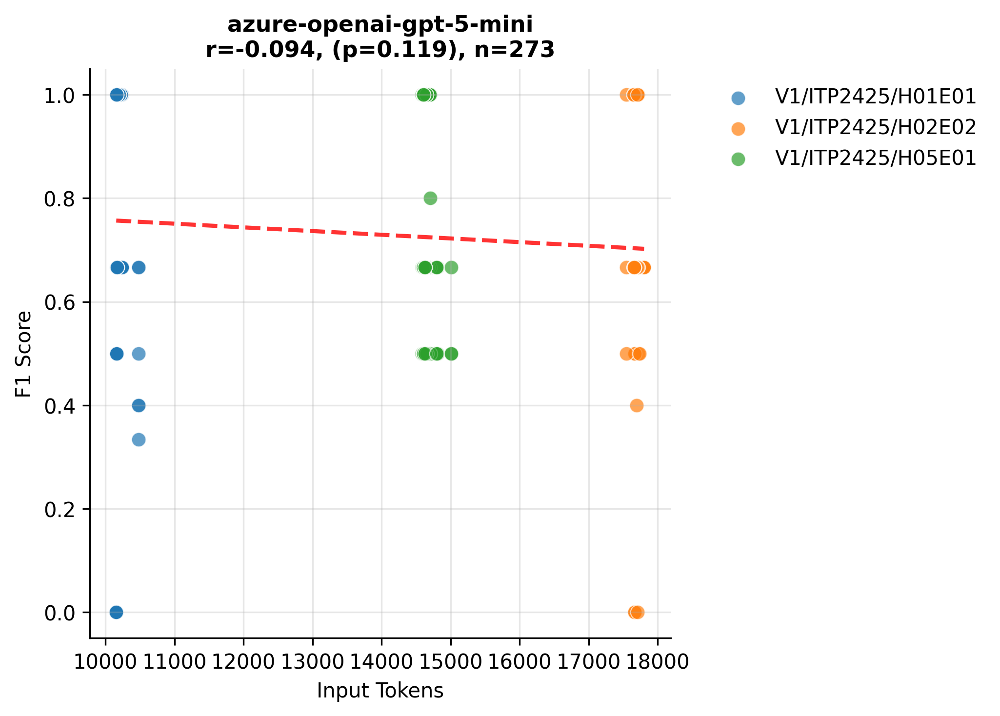
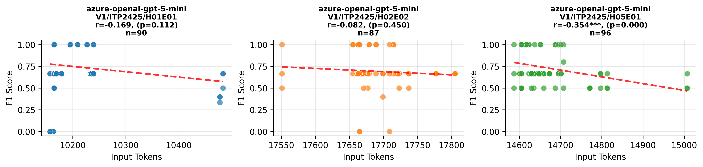

# Variants Analysis Report

## Dataset Summary

- Total annotated variants: 91
- Total gold issues: 93

| Exercise | Variants |
| --- | --- |
| V1/ITP2425/H01E01-Lectures | 30 |
| V1/ITP2425/H02E02-Panic_at_Seal_Saloon | 29 |
| V1/ITP2425/H05E01-Space_Seal_Farm | 32 |

| Issue Category | Count |
| --- | --- |
| ATTRIBUTE_TYPE_MISMATCH | 17 |
| CONSTRUCTOR_PARAMETER_MISMATCH | 10 |
| IDENTIFIER_NAMING_INCONSISTENCY | 23 |
| METHOD_PARAMETER_MISMATCH | 12 |
| METHOD_RETURN_TYPE_MISMATCH | 19 |
| VISIBILITY_MISMATCH | 12 |

| Artifact Type | Count |
| --- | --- |
| PROBLEM_STATEMENT | 89 |
| SOLUTION_REPOSITORY | 90 |
| TEMPLATE_REPOSITORY | 40 |

## Aggregate Results
| Benchmark | Config Key | N runs | TP | FP | FN | Precision | Recall | F1 | Span F1 | IoU | Avg Time (s) | Avg Cost (€) |
| --- | --- | --- | --- | --- | --- | --- | --- | --- | --- | --- | --- | --- |
| artemis-HEAD-66c9e6b98d | model=azure-openai-gpt-5-mini, reasoning_effort=medium | 3 | 267 | 214 | 12 | 0.555 | 0.957 | 0.703 | 0.431 | 0.309 | 19.444 | 0.0089 |
| pecv-reference | model=openai:gpt-5-mini, reasoning_effort=medium | 3 | 262 | 197 | 17 | 0.571 | 0.939 | 0.710 | 0.433 | 0.308 | 31.634 | 0 |

## Per Exercise Breakdown

### artemis-HEAD-66c9e6b98d :: model=azure-openai-gpt-5-mini, reasoning_effort=medium
| Exercise | TP | FP | FN | Precision | Recall | F1 | Span F1 | IoU | Avg Time (s) | Avg Cost (€) |
| --- | --- | --- | --- | --- | --- | --- | --- | --- | --- | --- |
| V1/ITP2425/H01E01-Lectures | 83 | 55 | 7 | 0.601 | 0.922 | 0.728 | 0.482 | 0.349 | 17.560 | 0.0066 |
| V1/ITP2425/H02E02-Panic_at_Seal_Saloon | 84 | 76 | 3 | 0.525 | 0.966 | 0.680 | 0.424 | 0.314 | 21.056 | 0.0104 |
| V1/ITP2425/H05E01-Space_Seal_Farm | 100 | 83 | 2 | 0.546 | 0.980 | 0.702 | 0.395 | 0.272 | 19.750 | 0.0096 |

*Benchmark results are provided under CC-BY-4.0; please attribute PECV Bench when reusing.*

## Correlation Analysis: Input Tokens vs F1 Score

| Model Name | Correlation | P-Value | N Samples |
| :--- | :--- | :--- | :--- |
| azure-openai-gpt-5-mini |   -0.094 |    0.119 | 273 |

*Significance: \*\*\* p<0.001, \*\* p<0.01, \* p<0.05*

## Per-Exercise Correlation Analysis

| Model | Exercise | Correlation | P-Value | N |
| :--- | :--- | :--- | :--- | :--- |
| azure-openai-gpt-5-mini | V1/ITP2425/H01E01-Lectures |   -0.169 |    0.112 | 90 |
| azure-openai-gpt-5-mini | V1/ITP2425/H02E02-Panic_at_Seal_Saloon |   -0.082 |    0.450 | 87 |
| azure-openai-gpt-5-mini | V1/ITP2425/H05E01-Space_Seal_Farm |   -0.354*** |    0.000 | 96 |

## Visualizations

### Model Performance (Tokens vs F1)

### Detailed Performance by Exercise

