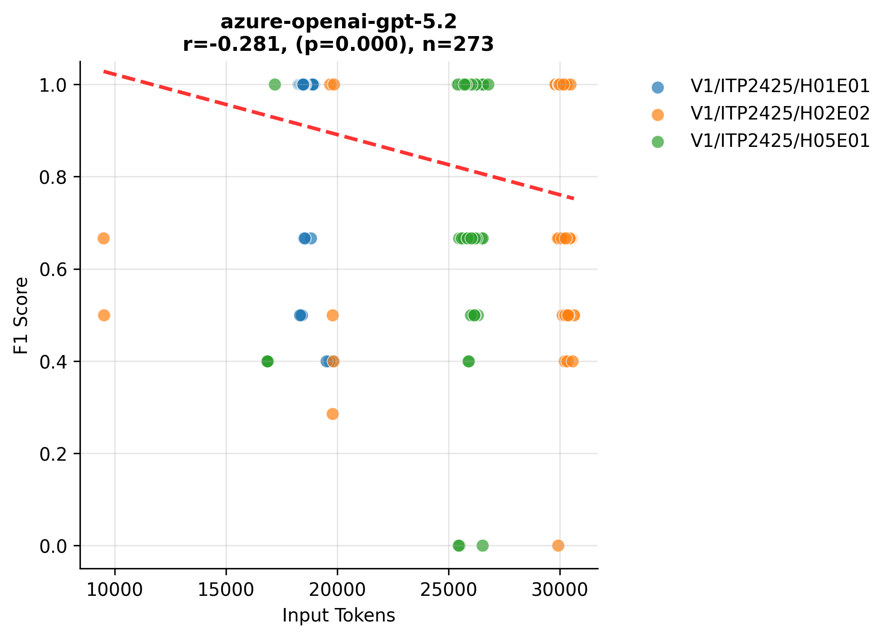
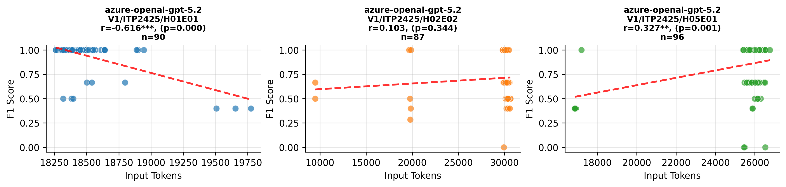

# Variants Analysis Report

## Dataset Summary

- Total annotated variants: 91
- Total gold issues: 93

| Exercise | Variants |
| --- | --- |
| V1/ITP2425/H01E01-Lectures | 30 |
| V1/ITP2425/H02E02-Panic_at_Seal_Saloon | 29 |
| V1/ITP2425/H05E01-Space_Seal_Farm | 32 |

| Issue Category | Count |
| --- | --- |
| ATTRIBUTE_TYPE_MISMATCH | 17 |
| CONSTRUCTOR_PARAMETER_MISMATCH | 10 |
| IDENTIFIER_NAMING_INCONSISTENCY | 23 |
| METHOD_PARAMETER_MISMATCH | 12 |
| METHOD_RETURN_TYPE_MISMATCH | 19 |
| VISIBILITY_MISMATCH | 12 |

| Artifact Type | Count |
| --- | --- |
| PROBLEM_STATEMENT | 89 |
| SOLUTION_REPOSITORY | 90 |
| TEMPLATE_REPOSITORY | 40 |

## Aggregate Results
| Benchmark | Config Key | N runs | TP | FP | FN | Precision | Recall | F1 | Span F1 | IoU | Avg Time (s) | Avg Cost (€) |
| --- | --- | --- | --- | --- | --- | --- | --- | --- | --- | --- | --- | --- |
| artemis-feature-hyperion-consistency_check_independent_verification_loop-9cd0b21e4a | model=azure-openai-gpt-5.2, reasoning_effort=medium | 3 | 270 | 157 | 9 | 0.632 | 0.968 | 0.765 | 0.467 | 0.331 | 29.841 | 0 |
| pecv-reference | model=openai:gpt-5-mini, reasoning_effort=medium | 3 | 262 | 197 | 17 | 0.571 | 0.939 | 0.710 | 0.433 | 0.308 | 31.634 | 0 |

## Per Exercise Breakdown

### artemis-feature-hyperion-consistency_check_independent_verification_loop-9cd0b21e4a :: model=azure-openai-gpt-5.2, reasoning_effort=medium
| Exercise | TP | FP | FN | Precision | Recall | F1 | Span F1 | IoU | Avg Time (s) | Avg Cost (€) |
| --- | --- | --- | --- | --- | --- | --- | --- | --- | --- | --- |
| V1/ITP2425/H01E01-Lectures | 90 | 18 | 0 | 0.833 | 1 | 0.909 | 0.458 | 0.318 | 22.151 | 0 |
| V1/ITP2425/H02E02-Panic_at_Seal_Saloon | 86 | 92 | 1 | 0.483 | 0.989 | 0.649 | 0.452 | 0.326 | 35.380 | 0 |
| V1/ITP2425/H05E01-Space_Seal_Farm | 94 | 47 | 8 | 0.667 | 0.922 | 0.774 | 0.488 | 0.348 | 32.030 | 0 |

*Benchmark results are provided under CC-BY-4.0; please attribute PECV Bench when reusing.*

## Correlation Analysis: Input Tokens vs F1 Score

| Model Name | Correlation | P-Value | N Samples |
| :--- | :--- | :--- | :--- |
| azure-openai-gpt-5.2 |   -0.281*** |    0.000 | 273 |

*Significance: \*\*\* p<0.001, \*\* p<0.01, \* p<0.05*

## Per-Exercise Correlation Analysis

| Model | Exercise | Correlation | P-Value | N |
| :--- | :--- | :--- | :--- | :--- |
| azure-openai-gpt-5.2 | V1/ITP2425/H01E01-Lectures |   -0.616*** |    0.000 | 90 |
| azure-openai-gpt-5.2 | V1/ITP2425/H02E02-Panic_at_Seal_Saloon |    0.103 |    0.344 | 87 |
| azure-openai-gpt-5.2 | V1/ITP2425/H05E01-Space_Seal_Farm |    0.327** |    0.001 | 96 |

## Visualizations

### Model Performance (Tokens vs F1)

### Detailed Performance by Exercise

