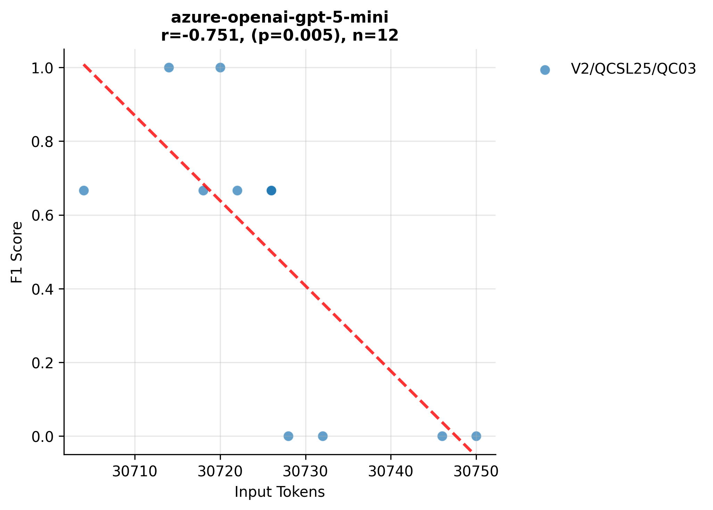
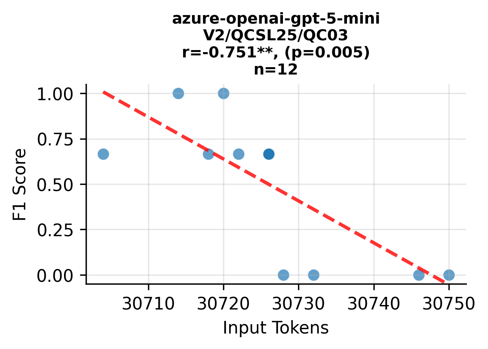

# Variants Analysis Report

## Dataset Summary

- Total annotated variants: 325
- Total gold issues: 331

| Exercise | Variants |
| --- | --- |
| V2/ERA2021/H00-Hello_World_ASM | 18 |
| V2/ERA2021/H03-Grafikspeicher | 18 |
| V2/ERA2021/P01-Raycasting_mit_Festkommazahlen | 18 |
| V2/IOS26/TC1-Bookstore | 18 |
| V2/IOS26/TC2-Developer | 18 |
| V2/ISE22/H05E01-REST_Architectural_Style | 18 |
| V2/ISE22/H10E01-Containers | 18 |
| V2/ITP2425/H01E01-Lectures | 30 |
| V2/ITP2425/H02E02-Panic_at_Seal_Saloon | 29 |
| V2/ITP2425/H05E01-Space_Seal_Farm | 32 |
| V2/ITP2425/SE01E01-UML | 18 |
| V2/MTG26/TA1-SQL_Advanced | 18 |
| V2/MTG26/TA2-SQL_Basics | 18 |
| V2/QCSL25/QC01-Decision_Diagrams_and_Tensor_Networks | 18 |
| V2/QCSL25/QC02-Far_Term_Quantum_Algorithms | 18 |
| V2/QCSL25/QC03-Magic_State_Distillation | 18 |

| Issue Category | Count |
| --- | --- |
| ATTRIBUTE_TYPE_MISMATCH | 57 |
| CONSTRUCTOR_PARAMETER_MISMATCH | 45 |
| IDENTIFIER_NAMING_INCONSISTENCY | 65 |
| METHOD_PARAMETER_MISMATCH | 53 |
| METHOD_RETURN_TYPE_MISMATCH | 62 |
| VISIBILITY_MISMATCH | 49 |

| Artifact Type | Count |
| --- | --- |
| PROBLEM_STATEMENT | 287 |
| SOLUTION_REPOSITORY | 325 |
| TEMPLATE_REPOSITORY | 219 |
| TESTS_REPOSITORY | 1 |

## Aggregate Results
| Benchmark | Config Key | N runs | TP | FP | FN | Precision | Recall | F1 | Span F1 | IoU | Avg Time (s) | Avg Cost (€) |
| --- | --- | --- | --- | --- | --- | --- | --- | --- | --- | --- | --- | --- |
| artemis-feature-hyperion-extend_run_pecv_bench_scripts-95b5bc53e7 | default | 1 | 8 | 12 | 4 | 0.400 | 0.667 | 0.500 | 0.857 | 0.794 | 37.154 | 0.0150 |
| pecv-reference | model=openai:gpt-5-mini, reasoning_effort=medium | 1 | 121 | 82 | 14 | 0.594 | 0.893 | 0.714 | 0.454 | 0.328 | 34.449 | — |

## Per Exercise Breakdown

### artemis-feature-hyperion-extend_run_pecv_bench_scripts-95b5bc53e7 :: default
| Exercise | TP | FP | FN | Precision | Recall | F1 | Span F1 | IoU | Avg Time (s) | Avg Cost (€) |
| --- | --- | --- | --- | --- | --- | --- | --- | --- | --- | --- |
| V2/QCSL25/QC03-Magic_State_Distillation | 8 | 12 | 4 | 0.400 | 0.667 | 0.500 | 0.857 | 0.794 | 37.154 | 0.0150 |

*Benchmark results are provided under CC-BY-4.0; please attribute PECV Bench when reusing.*

## Correlation Analysis: Input Tokens vs F1 Score

| Model Name | Correlation | P-Value | N Samples |
| :--- | :--- | :--- | :--- |
| azure-openai-gpt-5-mini |   -0.751** |    0.005 | 12 |

*Significance: \*\*\* p<0.001, \*\* p<0.01, \* p<0.05*

## Per-Exercise Correlation Analysis

| Model | Exercise | Correlation | P-Value | N |
| :--- | :--- | :--- | :--- | :--- |
| azure-openai-gpt-5-mini | V2/QCSL25/QC03-Magic_State_Distillation |   -0.751** |    0.005 | 12 |

## Visualizations

### Model Performance (Tokens vs F1)

### Detailed Performance by Exercise

