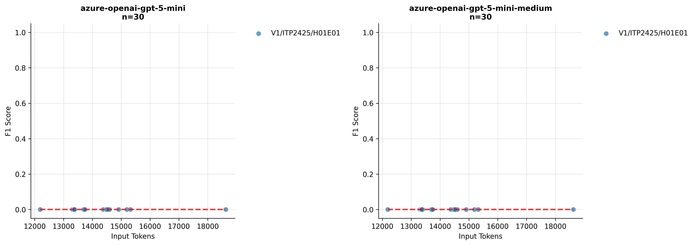
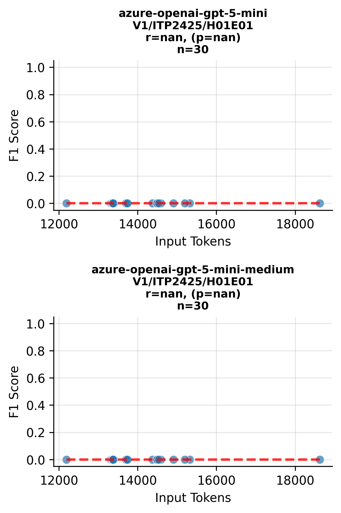

# Variants Analysis Report

## Dataset Summary

- Total annotated variants: 91
- Total gold issues: 93

| Exercise | Variants |
| --- | --- |
| V1/ITP2425/H01E01-Lectures | 30 |
| V1/ITP2425/H02E02-Panic_at_Seal_Saloon | 29 |
| V1/ITP2425/H05E01-Space_Seal_Farm | 32 |

| Issue Category | Count |
| --- | --- |
| ATTRIBUTE_TYPE_MISMATCH | 17 |
| CONSTRUCTOR_PARAMETER_MISMATCH | 10 |
| IDENTIFIER_NAMING_INCONSISTENCY | 23 |
| METHOD_PARAMETER_MISMATCH | 12 |
| METHOD_RETURN_TYPE_MISMATCH | 19 |
| VISIBILITY_MISMATCH | 12 |

| Artifact Type | Count |
| --- | --- |
| PROBLEM_STATEMENT | 89 |
| SOLUTION_REPOSITORY | 90 |
| TEMPLATE_REPOSITORY | 40 |

## Aggregate Results
| Benchmark | Config Key | N runs | TP | FP | FN | Precision | Recall | F1 | Span F1 | IoU | Avg Time (s) | Avg Cost (€) |
| --- | --- | --- | --- | --- | --- | --- | --- | --- | --- | --- | --- | --- |
| artemis-feature-hyperion-consistency_check_scripts-39a20d8576 | default | 1 | 0 | 0 | 30 | 0 | 0 | 0 | — | — | 7.349 | 0.0050 |
| pecv-reference | model=openai:gpt-5-mini, reasoning_effort=medium | 1 | 121 | 82 | 14 | 0.594 | 0.893 | 0.714 | 0.454 | 0.328 | 34.449 | — |
| artemis-feature-hyperion-consistency_check_scripts-39a20d8576 | model=azure-openai-gpt-5-mini, reasoning_effort=medium | 1 | 0 | 1 | 30 | 0 | 0 | 0 | — | — | 7.513 | 0.0052 |

## Per Exercise Breakdown

### artemis-feature-hyperion-consistency_check_scripts-39a20d8576 :: default
| Exercise | TP | FP | FN | Precision | Recall | F1 | Span F1 | IoU | Avg Time (s) | Avg Cost (€) |
| --- | --- | --- | --- | --- | --- | --- | --- | --- | --- | --- |
| V1/ITP2425/H01E01-Lectures | 0 | 0 | 30 | 0 | 0 | 0 | — | — | 7.349 | 0.0050 |

### artemis-feature-hyperion-consistency_check_scripts-39a20d8576 :: model=azure-openai-gpt-5-mini, reasoning_effort=medium
| Exercise | TP | FP | FN | Precision | Recall | F1 | Span F1 | IoU | Avg Time (s) | Avg Cost (€) |
| --- | --- | --- | --- | --- | --- | --- | --- | --- | --- | --- |
| V1/ITP2425/H01E01-Lectures | 0 | 1 | 30 | 0 | 0 | 0 | — | — | 7.513 | 0.0052 |

*Benchmark results are provided under CC-BY-4.0; please attribute PECV Bench when reusing.*

## Correlation Analysis: Input Tokens vs F1 Score

| Model Name | Correlation | P-Value | N Samples |
| :--- | :--- | :--- | :--- |
| azure-openai-gpt-5-mini | Invalid | N/A | 30 |
| azure-openai-gpt-5-mini-medium | Invalid | N/A | 30 |

*Significance: \*\*\* p<0.001, \*\* p<0.01, \* p<0.05*

## Per-Exercise Correlation Analysis

| Model | Exercise | Correlation | P-Value | N |
| :--- | :--- | :--- | :--- | :--- |
| azure-openai-gpt-5-mini | V1/ITP2425/H01E01-Lectures | Invalid | N/A | 30 |
| azure-openai-gpt-5-mini-medium | V1/ITP2425/H01E01-Lectures | Invalid | N/A | 30 |

## Visualizations

### Model Performance (Tokens vs F1)

### Detailed Performance by Exercise

