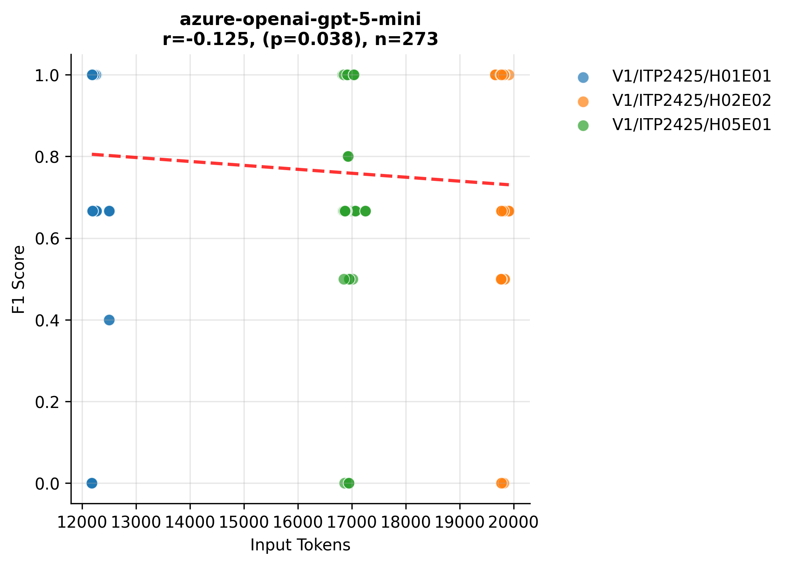
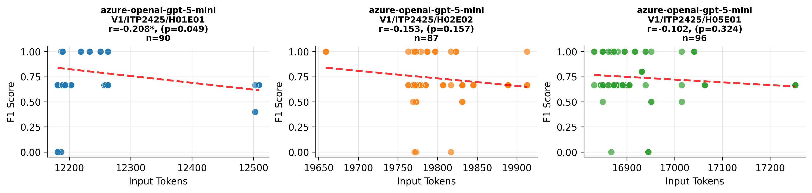

# Variants Analysis Report

## Dataset Summary

- Total annotated variants: 91
- Total gold issues: 93

| Exercise | Variants |
| --- | --- |
| V1/ITP2425/H01E01-Lectures | 30 |
| V1/ITP2425/H02E02-Panic_at_Seal_Saloon | 29 |
| V1/ITP2425/H05E01-Space_Seal_Farm | 32 |

| Issue Category | Count |
| --- | --- |
| ATTRIBUTE_TYPE_MISMATCH | 17 |
| CONSTRUCTOR_PARAMETER_MISMATCH | 10 |
| IDENTIFIER_NAMING_INCONSISTENCY | 23 |
| METHOD_PARAMETER_MISMATCH | 12 |
| METHOD_RETURN_TYPE_MISMATCH | 19 |
| VISIBILITY_MISMATCH | 12 |

| Artifact Type | Count |
| --- | --- |
| PROBLEM_STATEMENT | 89 |
| SOLUTION_REPOSITORY | 90 |
| TEMPLATE_REPOSITORY | 40 |

## Aggregate Results
| Benchmark | Config Key | N runs | TP | FP | FN | Precision | Recall | F1 | Span F1 | IoU | Avg Time (s) | Avg Cost (€) |
| --- | --- | --- | --- | --- | --- | --- | --- | --- | --- | --- | --- | --- |
| artemis-feature-hyperion-disable_threads_for_consistency_check_evaluation_scripts-1cea00d3d9 | model=azure-openai-gpt-5-mini, reasoning_effort=medium | 3 | 265 | 165 | 14 | 0.616 | 0.950 | 0.748 | 0.424 | 0.302 | 19.278 | 0.0093 |
| pecv-reference | model=openai:gpt-5-mini, reasoning_effort=medium | 3 | 262 | 197 | 17 | 0.571 | 0.939 | 0.710 | 0.433 | 0.308 | 31.634 | 0 |

## Per Exercise Breakdown

### artemis-feature-hyperion-disable_threads_for_consistency_check_evaluation_scripts-1cea00d3d9 :: model=azure-openai-gpt-5-mini, reasoning_effort=medium
| Exercise | TP | FP | FN | Precision | Recall | F1 | Span F1 | IoU | Avg Time (s) | Avg Cost (€) |
| --- | --- | --- | --- | --- | --- | --- | --- | --- | --- | --- |
| V1/ITP2425/H01E01-Lectures | 85 | 39 | 5 | 0.685 | 0.944 | 0.794 | 0.438 | 0.313 | 14.758 | 0.0071 |
| V1/ITP2425/H02E02-Panic_at_Seal_Saloon | 84 | 64 | 3 | 0.568 | 0.966 | 0.715 | 0.422 | 0.312 | 22.765 | 0.0108 |
| V1/ITP2425/H05E01-Space_Seal_Farm | 96 | 62 | 6 | 0.608 | 0.941 | 0.738 | 0.413 | 0.285 | 20.354 | 0.0100 |

*Benchmark results are provided under CC-BY-4.0; please attribute PECV Bench when reusing.*

## Correlation Analysis: Input Tokens vs F1 Score

| Model Name | Correlation | P-Value | N Samples |
| :--- | :--- | :--- | :--- |
| azure-openai-gpt-5-mini |   -0.125* |    0.038 | 273 |

*Significance: \*\*\* p<0.001, \*\* p<0.01, \* p<0.05*

## Per-Exercise Correlation Analysis

| Model | Exercise | Correlation | P-Value | N |
| :--- | :--- | :--- | :--- | :--- |
| azure-openai-gpt-5-mini | V1/ITP2425/H01E01-Lectures |   -0.208* |    0.049 | 90 |
| azure-openai-gpt-5-mini | V1/ITP2425/H02E02-Panic_at_Seal_Saloon |   -0.153 |    0.157 | 87 |
| azure-openai-gpt-5-mini | V1/ITP2425/H05E01-Space_Seal_Farm |   -0.102 |    0.324 | 96 |

## Visualizations

### Model Performance (Tokens vs F1)

### Detailed Performance by Exercise

