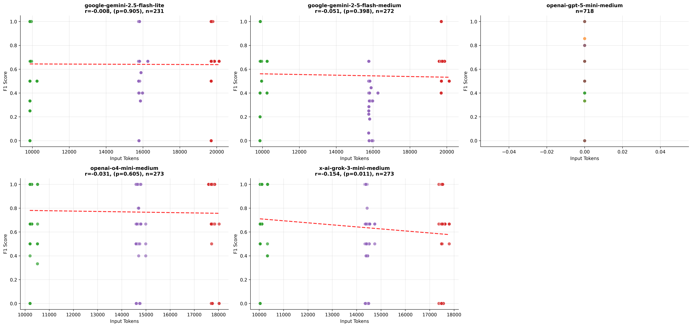
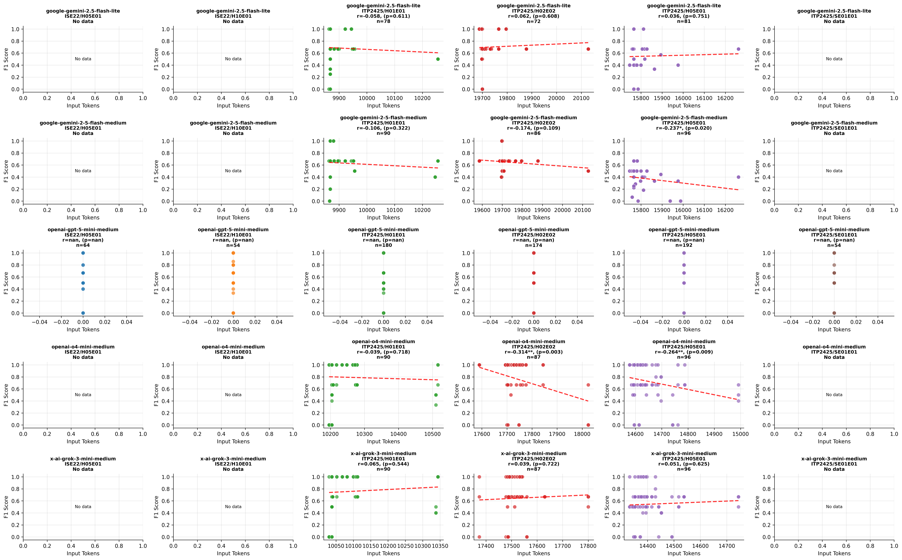

# Variants Analysis Report

## Correlation Analysis: Input Tokens vs F1 Score

| Model Name | Correlation | P-Value | N Samples |
| :--- | :--- | :--- | :--- |
| google-gemini-2.5-flash-lite |   -0.008 |    0.905 | 231 |
| google-gemini-2-5-flash-medium |   -0.051 |    0.398 | 272 |
| openai-gpt-5-mini-medium | Invalid | N/A | 273 |
| openai-o4-mini-medium |   -0.031 |    0.605 | 273 |
| x-ai-grok-3-mini-medium |   -0.154* |    0.011 | 273 |

*Significance: \*\*\* p<0.001, \*\* p<0.01, \* p<0.05*

## Per-Exercise Correlation Analysis

| Model | Exercise | Correlation | P-Value | N |
| :--- | :--- | :--- | :--- | :--- |
| google-gemini-2-5-flash-medium | ITP2425/H01E01-Lectures |   -0.106 |    0.322 | 90 |
| google-gemini-2-5-flash-medium | ITP2425/H02E02-Panic_at_Seal_Saloon |   -0.174 |    0.109 | 86 |
| google-gemini-2-5-flash-medium | ITP2425/H05E01-Space_Seal_Farm |   -0.237* |    0.020 | 96 |
| google-gemini-2.5-flash-lite | ITP2425/H01E01-Lectures |   -0.058 |    0.611 | 78 |
| google-gemini-2.5-flash-lite | ITP2425/H02E02-Panic_at_Seal_Saloon |    0.062 |    0.608 | 72 |
| google-gemini-2.5-flash-lite | ITP2425/H05E01-Space_Seal_Farm |    0.036 |    0.751 | 81 |
| openai-gpt-5-mini-medium | ITP2425/H01E01-Lectures | Invalid | N/A | 90 |
| openai-gpt-5-mini-medium | ITP2425/H02E02-Panic_at_Seal_Saloon | Invalid | N/A | 87 |
| openai-gpt-5-mini-medium | ITP2425/H05E01-Space_Seal_Farm | Invalid | N/A | 96 |
| openai-o4-mini-medium | ITP2425/H01E01-Lectures |   -0.039 |    0.718 | 90 |
| openai-o4-mini-medium | ITP2425/H02E02-Panic_at_Seal_Saloon |   -0.314** |    0.003 | 87 |
| openai-o4-mini-medium | ITP2425/H05E01-Space_Seal_Farm |   -0.264** |    0.009 | 96 |
| x-ai-grok-3-mini-medium | ITP2425/H01E01-Lectures |    0.065 |    0.544 | 90 |
| x-ai-grok-3-mini-medium | ITP2425/H02E02-Panic_at_Seal_Saloon |    0.039 |    0.722 | 87 |
| x-ai-grok-3-mini-medium | ITP2425/H05E01-Space_Seal_Farm |    0.051 |    0.625 | 96 |

## Visualizations

### Model Performance (Tokens vs F1)

### Detailed Performance by Exercise

